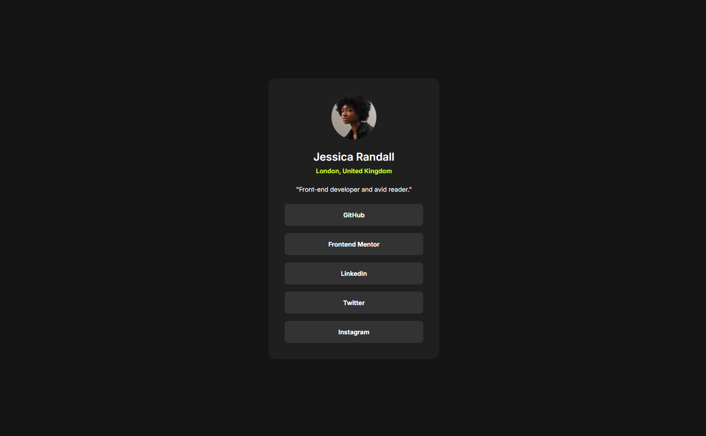

# 🌐 Frontend Mentor - Social links profile solution

This is my solution for the [Social links profile challenge on Frontend Mentor](https://www.frontendmentor.io/challenges/social-links-profile-UG32l9m6dQ). Frontend Mentor challenges help you improve your coding skills by building realistic projects.

---

## 📋 Table of contents

- [Overview](#-overview)
  - [Features](#-features)
  - [Preview](#-preview)
  - [Links](#-links)
- [My process](#-my-process)
  - [Built with](#-built-with)
  - [What I learned](#-what-i-learned)
- [Development Workflow](#-development-workflow)
- [Useful Resources](#-useful-resources)
- [Author](#-author)
- [Acknowledgments](#-acknowledgments)

---

## 🌍 Overview

### ✨ Features

### 🖼️ Preview



### 🔗 Links

- 💡 Solution URL: [Frontend Mentor Submission](https://your-solution-url.com)
- 🌐 Live Site URL: [Live Demo](https://your-live-site-url.com)

---

## 🛠️ My process

### 🧰 Built with

| Category  | Tools                           |
| --------- | ------------------------------- |
| Structure | **Semantic HTML5 markup**       |
| Styles    | **CSS** and **Tailwind CSS v4** |

### 🧠 What I learned

- Improved my understanding of semantic HTML5 markup
- Strengthened my styling skills using CSS and Tailwind CSS
- Explored creating animations to enhance the user experience
- Enhanced accessibility by ensuring the page can be easily navigated using only the keyboard

Here is a snippet which shows the tabindex:

```html
<div class="social-links">
  <button><a href="#" tabindex="-1">GitHub</a></button>
  <button><a href="#" tabindex="-1">Frontend Mentor</a></button>
  <button><a href="#" tabindex="-1">LinkedIn</a></button>
  <button><a href="#" tabindex="-1">Twitter</a></button>
  <button><a href="#" tabindex="-1">Instagram</a></button>
</div>
```

The button is focusable via the Tab key, and tabindex ensures the focus stays on the button rather focusing only the a tag.

---

## 🧩 Development Workflow

### 🧱 Local Setup

1. **Start using Tailwind in your HTML**
   ```html
   <link rel="stylesheet" href="styles/tailwindcss/output.css" />
   ```
2. **Start using CSS in your HTML**
   ```html
   <link rel="stylesheet" href="styles/css/index.css" />
   ```

Then open your index.html file in the browser.

---

## 📖 Useful Resources

- [HTML Semantic Elements](https://www.w3schools.com/html/html5_semantic_elements.asp) - A helpful article explaining semantic HTML5 elements and their purpose.
- [CSS Animations](https://www.w3schools.com/css/css3_animations.asp) - A clear introduction to CSS animations and keyframes.
- [HTML tabindex](https://developer.mozilla.org/en-US/docs/Web/HTML/Reference/Global_attributes/tabindex) - Explains how to manage element focus order and improve keyboard accessibility.

---

## 👨‍💻 Author

- GitHub - [CrazyWizard04](https://github.com/CrazyWizard04)
- Frontend Mentor - [@CrazyWizard04](https://www.frontendmentor.io/profile/crazywizard04)

---

## 💖 Acknowledgments

A big thanks to **Frontend Mentor** for providing this project.
Their challenges are a great way for developers of all levels to practice, learn, and improve their skills through real-world examples.

Thank you <3
